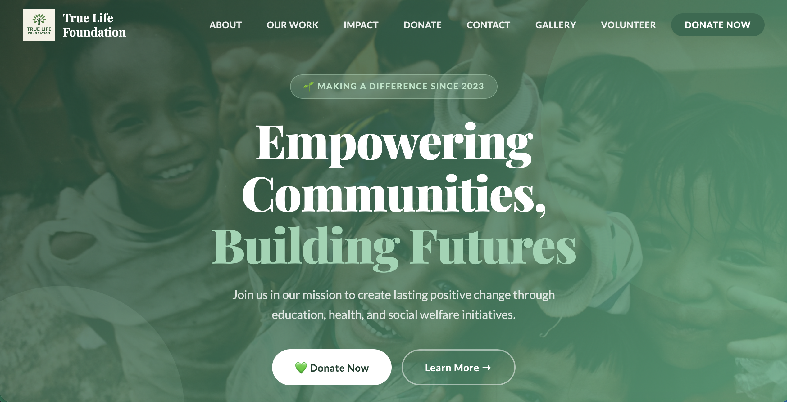
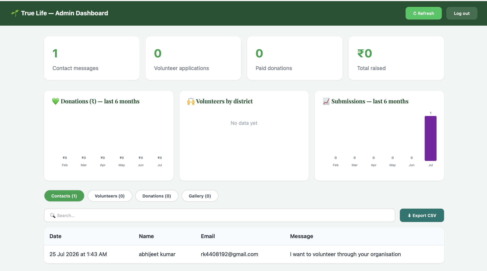

# 🌱 True Life Foundation — Full-Stack NGO Platform

A complete web platform for a non-profit foundation, built with the **MERN**
stack. Visitors can explore programmes, apply to volunteer, and donate online
(real payments via Razorpay). A secure admin dashboard lets the organisation
manage every submission, view analytics, and publish a media gallery.

> Built as an end-to-end full-stack project: REST API, authentication, online
> payments, file uploads, and an analytics dashboard.

---

## 🧰 Tech Stack

**Frontend:** React 18 · Vite · React Router · plain CSS
**Backend:** Node.js · Express · MongoDB · Mongoose
**Auth:** JWT (JSON Web Tokens) · bcrypt password hashing
**Payments:** Razorpay (order creation + server-side signature verification)
**Other:** Multer (file uploads) · Nodemailer (email) · express-validator · express-rate-limit

---

## ✨ Features

**Public site**
- Responsive landing page with programme sections (Education, Health, Social Welfare)
- Contact form that saves messages to the database
- Multi-step volunteer application with validation and CV upload
- Online donations via Razorpay with an auto-generated donation receipt
- Programme photo/video gallery (with YouTube support)

**Admin dashboard** (`/admin`, JWT-protected)
- Secure login (hashed passwords, token auth)
- Analytics charts — donations by month, volunteers by district, submissions trend
- View & manage contacts, volunteer applications (status updates), and donations
- Full-text search and CSV export
- Download applicant CVs
- Upload and organise gallery media by programme

**Engineering**
- RESTful API with input validation and centralised error handling
- Rate limiting on public endpoints to blunt spam/abuse
- Payment integrity verified server-side via HMAC signature
- Code-split React routes for a fast initial load
- Environment-based config; secrets never committed

---

## 🏗️ Architecture

```
┌─────────────────┐        HTTPS / JSON        ┌──────────────────┐
│   React (Vite)  │  ───────────────────────►  │  Express REST API │
│   frontend/     │  ◄───────────────────────  │  backend/         │
└─────────────────┘                            └────────┬─────────┘
                                                        │ Mongoose
                                          ┌─────────────┼──────────────┐
                                          │             │              │
                                    ┌─────▼────┐  ┌─────▼─────┐  ┌─────▼─────┐
                                    │ MongoDB  │  │ Razorpay  │  │  Nodemailer│
                                    │ (data)   │  │ (payments)│  │  (email)   │
                                    └──────────┘  └───────────┘  └───────────┘
```

---

## 📁 Project structure

```
truelife/
├── frontend/                 # React (Vite) app
│   └── src/
│       ├── components/       # Header, Hero, Donate, gallery, admin charts…
│       ├── pages/            # work pages, VolunteerPage, GalleryPage, AdminPage
│       └── services/api.js   # backend API client
│
└── backend/                  # Express API
    └── src/
        ├── index.js          # startup
        ├── app.js            # Express app + middleware
        ├── config/           # db, razorpay, upload
        ├── models/           # Mongoose schemas
        ├── routes/           # contact, volunteers, donations, gallery, admin
        ├── middleware/       # auth (JWT), error handling
        └── utils/            # validation, email
```

---

## 🚀 Getting started

**Prerequisites:** Node.js 18+, MongoDB running locally (`brew services start mongodb-community`).

```bash
# 1. Install both frontend and backend
npm run install:all

# 2. Configure the backend
cd backend
cp .env.example .env          # fill in values (Mongo URI, JWT secret, Razorpay keys)
node src/scripts/createAdmin.js admin@truelife.org "YourPassword" "Your Name"

# 3. Run (two terminals, from the project root)
npm run dev:backend           # http://localhost:5001
npm run dev:frontend          # http://localhost:5173
```

Admin dashboard: `http://localhost:5173/admin`

---

## 🔌 API overview

| Method | Endpoint | Description |
|--------|----------|-------------|
| POST | `/api/contact` | Submit a contact message |
| POST | `/api/volunteers` | Submit a volunteer application |
| POST | `/api/volunteers/:id/cv` | Attach a CV to an application |
| POST | `/api/donations/order` | Create a Razorpay order |
| POST | `/api/donations/verify` | Verify a completed payment |
| GET  | `/api/gallery` | List gallery items (filter by `?category=`) |
| POST | `/api/admin/login` | Get a JWT |
| GET  | `/api/admin/stats` | Dashboard summary |
| GET  | `/api/admin/contacts` · `/volunteers` · `/donations` | List submissions |

Full details in [`backend/README.md`](backend/README.md).

---

## 📸 Screenshots

<!-- Add your screenshots to the docs/ folder (see docs/README.md for how). -->

| Home | Admin Dashboard | Gallery |
|------|-----------------|---------|
|  |  |  |

---

## 🗺️ Roadmap

- [ ] Deploy live (Vercel + Render + MongoDB Atlas)
- [ ] Cloud image storage (Cloudinary) for the gallery
- [ ] Automated API tests (Jest + Supertest)
- [ ] 80G tax-exemption receipts (once registered)

---

Built with care for a cause. 💚
